# 最新后端接口文档

- 接口中没有指定 base url 的统一使用 app 配置面板配置的地址(ip:port)，存在完整地址的则不用。该配置默认地址为 http://hzmq1.hainasmart.com.cn
- 目前只有 `/v3/handheld/device/register`、`/v3/handheld/auth/login`、`device/activate` 不需要带用户登录认证 token，其它接口都需要在请求头中携带 `Authorization: Bearer <token>`
- app 客户端根本就不需要区别用户调整线体，客户端只管上传用户的打卡记录，线体调整在平台后端处理。这样的话，客户端打卡记录面板需要从平台后端获取，app端打卡记录只是单纯的展示，如果请求不到，则展示为加载中。

## 鉴权说明

1. 不需要用户登录 token 的接口只有：
   - `/v3/handheld/device/register`
   - `/v3/handheld/auth/login`
2. 其余接口默认都需要在请求头中携带：

```http
Authorization: Bearer <token>
```

3. `device_id` 仍然需要按各接口定义继续显式传递，不能因为带了 token 就省略。

## 设备自主注册

### OpenAPI 接口规范

```yaml
openapi: 3.0.1
info:
  title: ''
  description: ''
  version: 1.0.0
paths:
  /v3/handheld/device/register:
    post:
      summary: 设备自主注册
      deprecated: false
      description: 新设备首次开机时自主注册，获取设备ID和初始凭证
      tags:
        - 手持机接口
      parameters: []
      requestBody:
        content:
          application/json:
            schema:
              type: object
              required:
                - company_id
                - device_name
                - device_id
                - ip
                - software_version
              properties:
                company_id:
                  type: integer
                  description: 公司id，需要用户在app配置面板输入数字
                device_name:
                  type: string
                  description: 设备名称
                device_id:
                  type: string
                  description: 设备唯一ID，优先使用设备指纹做 SHA-256 摘要并截取前 16 位大写十六进制字符；取不到时回退为本地持久化的 16 位随机值
                ip:
                  type: string
                  description: 设备ip地址
                software_version:
                  type: string
                  description: 设备安装软件版本
              x-apifox-orders:
                - company_id
                - device_name
                - device_id
                - ip
                - software_version
            example:
              company_id: 2
              device_name: 手持机01
              device_id: A1B2C3D4E5F60789
              ip: 192.168.1.123
              software_version: 1.0.0
      responses:
        '200':
          description: success
          content:
            application/json:
              schema:
                type: object
                properties: {}
                x-apifox-orders: []
              example:
                code: 200
                msg: success
                data:
                  device_id: A1B2C3D4E5F60789
          headers: {}
          x-apifox-name: ''
      security: []
      x-apifox-folder: 手持机接口
      x-apifox-status: released
      x-run-in-apifox: https://app.apifox.com/web/project/8443306/apis/api-474654388-run
servers:
  - url: http://hzmq1.hainasmart.com.cn
    description: 正式环境
security: []
```

### 注册流程图

以下流程图描述设备首次启动后，调用 `/v3/handheld/device/register` 完成自主注册的主流程。

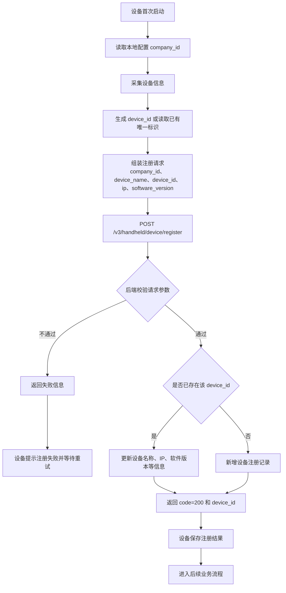

### 注册时序图

以下时序图描述设备、后端接口和设备注册数据存储之间的交互顺序。

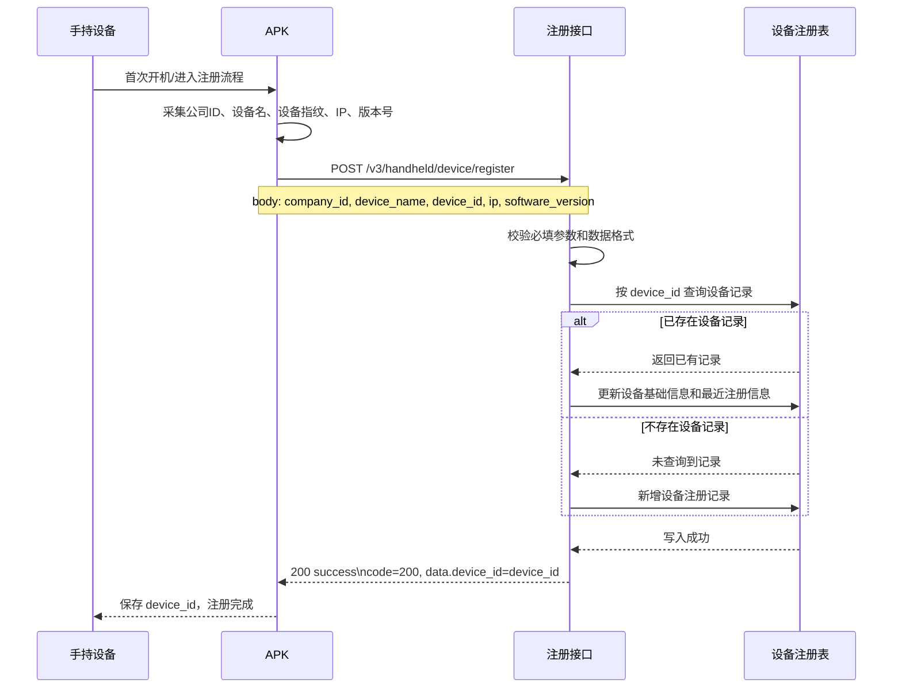

### 说明

1. `company_id` 由用户在 App 配置面板预先录入，设备注册时直接带给后端。
2. `device_id` 应保持稳定。当前客户端实现是优先使用设备指纹做 SHA-256 摘要并截取前 16 位大写十六进制字符；只有在设备指纹不可用时，才回退到本地持久化的 16 位随机值。
3. 同一 `device_id` 再次调用注册接口时，后端更适合按“幂等注册”处理，即更新设备当前信息而不是重复新增。
4. 当前接口响应示例只返回 `device_id`，因此设备端可将“是否注册成功”的判断依据收敛为 `code=200` 且返回了有效 `device_id`。

## 设备激活

### 鉴权要求

### OpenAPI接口规范

```yaml
openapi: 3.0.1
info:
  title: ''
  description: ''
  version: 1.0.0
paths:
  /device/activate:
    post:
      summary: 设备激活
      deprecated: false
      description: 设备注册后才能进行激活，使用百度在线激活，从平台后端激活码后调用在线激活函数在线激活。
      tags:
        - 手持机接口
      parameters: []
      requestBody:
        content:
          application/json:
            schema:
              type: object
              required:
                - device_id
              properties:
                device_id:
                  type: string
                  description: 设备ID，通过该参数从平台后端获取激活码
              x-apifox-orders:
                - device_id
            example:
              device_id: A1B2C3D4E5F60789
      responses:
        '200':
          description: success
          content:
            application/json:
              schema:
                type: object
                properties:
                  code:
                    type: integer
                  msg:
                    type: string
                  data:
                    type: object
                    properties:
                      device_id:
                        type: string
                      activation_code:
                        type: string
                    x-apifox-orders:
                      - device_id
                      - activation_code
                x-apifox-orders:
                  - code
                  - msg
                  - data
              example:
                code: 200
                msg: success
                data:
                  device_id: A1B2C3D4E5F60789
                  activation_code: ACT-8X9K-2026-ABCD
          headers: {}
          x-apifox-name: ''
      security: []
      x-apifox-folder: 手持机接口
      x-apifox-status: released
      x-run-in-apifox: https://app.apifox.com/web/project/8443306/apis/api-474701529-run
servers:
  - url: http://park.hainasmart.com.cn:8898
    description: 正式环境
security: []
```

### 激活流程图

以下流程图描述设备完成注册后，调用 `/device/activate` 获取激活码，并在本地执行百度在线激活的主流程。

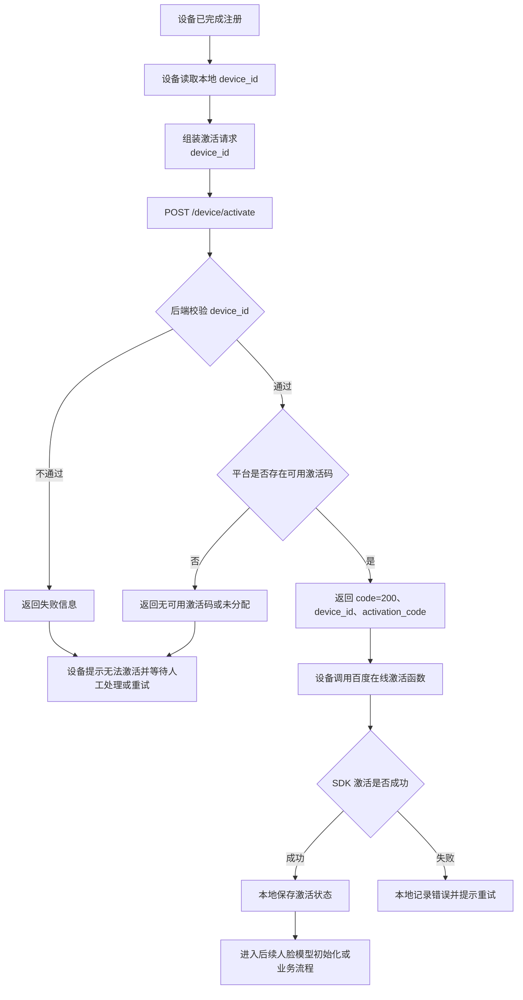

### 激活时序图

以下时序图描述设备、激活接口、平台数据存储和百度在线激活 SDK 之间的交互顺序。

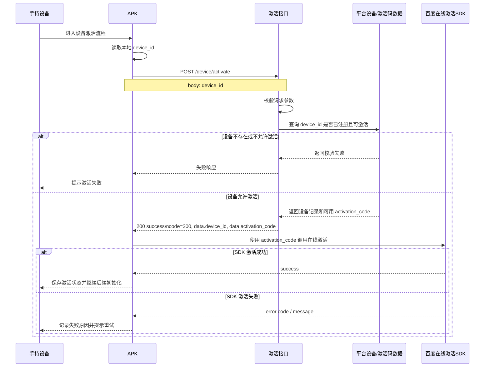

### 说明

1. 该接口的职责是按 `device_id` 从平台后端获取 `activation_code`，不直接代表设备已经完成百度 SDK 激活。
2. 设备激活的前置条件是已完成注册，否则后端无法基于 `device_id` 做设备身份校验和激活码下发。
3. 当前接口文档只定义了“获取激活码”，没有定义“激活结果回传”接口，因此后端暂时无法仅靠该接口闭环感知 SDK 激活成功或失败。
4. 若后续需要后台可追踪激活结果，建议补充一个“设备激活结果上报”接口，用于回传 SDK 返回码、错误信息和激活时间。

## 用户登录

### OpenAPI接口规范

```yaml
openapi: 3.0.1
info:
  title: ''
  description: ''
  version: 1.0.0
paths:
  /v3/handheld/auth/login:
    post:
      summary: 设备登录
      deprecated: false
      description: 设备使用账号密码登录并获取JWT Token
      tags:
        - 手持机接口
      parameters: []
      requestBody:
        content:
          application/json:
            schema:
              type: object
              required:
                - account
                - password
                - device_id
              properties:
                account:
                  type: string
                  description: 设备账号
                password:
                  type: string
                  description: 设备密码
                device_id:
                  type: string
                  description: 设备唯一ID
              x-apifox-orders:
                - account
                - password
                - device_id
            example:
              account: admin
              password: '123456'
              device_id: A1B2C3D4E5F60789
      responses:
        '200':
          description: success
          content:
            application/json:
              schema:
                type: object
                properties: {}
                x-apifox-orders: []
              example:
                code: 200
                msg: success
                data:
                  token: eyJhbGciOiJIUzI1NiIs...
                  expires_in: 604800
                  token_expire_at: 1750604800
                  device:
                    device_id: A1B2C3D4E5F60789
                    name: 手持机01
          headers: {}
          x-apifox-name: ''
      security: []
      x-apifox-folder: 手持机接口
      x-apifox-status: released
      x-run-in-apifox: https://app.apifox.com/web/project/8443306/apis/api-474761721-run
servers:
  - url: http://hzmq1.hainasmart.com.cn
    description: 正式环境
security: []
```

- 用户登录 ui 中默认用户名是 admin；默认登录密码是 a123456!

### 用户登录流程图

以下流程图描述设备在已完成注册的前提下，如何使用账号、密码和 `device_id` 调用登录接口获取 JWT Token。

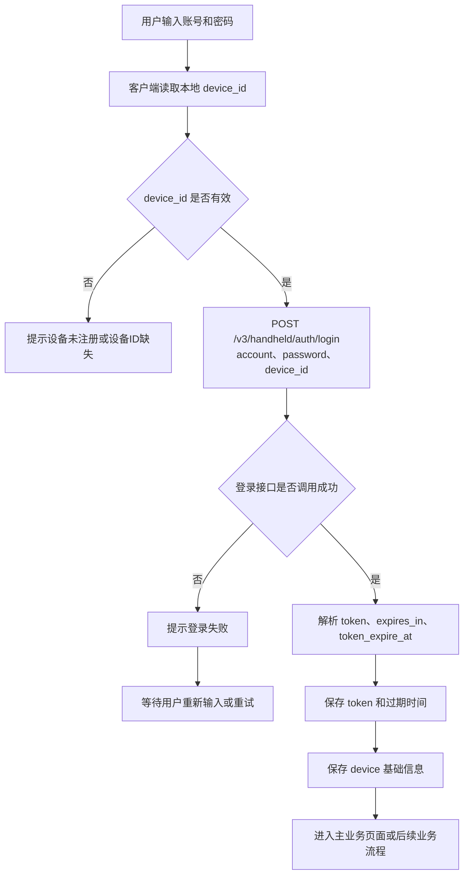

### 用户登录时序图

以下时序图描述用户、客户端、登录接口和本地会话存储之间的交互顺序。

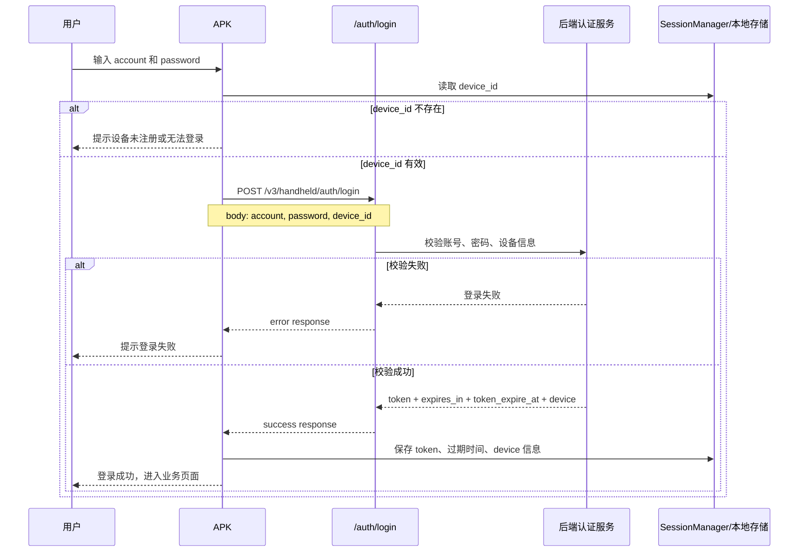

### 图示说明

1. 登录请求必须显式携带 `device_id`，用于把用户登录态和当前设备绑定起来。
2. 若本地没有有效 `device_id`，客户端应先完成设备注册，而不是直接发起登录请求。
3. 登录成功后，客户端至少需要保存 `token`、`expires_in`、`token_expire_at` 和返回的设备信息。

## Token刷新

### 鉴权要求

需要携带用户登录 token，请求头和请求体中的旧 token 应保持一致：

```http
Authorization: Bearer <token>
```

### OpenAPI接口规范

```yaml
openapi: 3.0.1
info:
  title: ''
  description: ''
  version: 1.0.0
paths:
  /v3/handheld/auth/refresh:
    post:
      summary: Token刷新
      deprecated: false
      description: 使用旧token换取新token
      tags:
        - 手持机接口
      parameters: []
      requestBody:
        content:
          application/json:
            schema:
              type: object
              required:
                - token
              properties:
                token:
                  type: string
                  description: 旧JWT Token
              x-apifox-orders:
                - token
            example:
              token: eyJhbGciOiJIUzI1NiIs...
      responses:
        '200':
          description: success
          content:
            application/json:
              schema:
                type: object
                properties: {}
                x-apifox-orders: []
              example:
                code: 200
                msg: success
                data:
                  token: eyJhbGciOiJIUzI1NiIs...
                  expires_in: 604800
                  token_expire_at: 1750604800
          headers: {}
          x-apifox-name: ''
      security: []
      x-apifox-folder: 手持机接口
      x-apifox-status: released
      x-run-in-apifox: https://app.apifox.com/web/project/8443306/apis/api-474761722-run
components:
  schemas: {}
  securitySchemes:
    BearerAuth:
      type: jwt
      scheme: bearer
      bearerFormat: JWT
servers:
  - url: http://hzmq1.hainasmart.com.cn
    description: 正式环境
security: []
```

### Token刷新流程图

以下流程图描述客户端在检测到 Token 即将过期或需要续期时，如何使用旧 Token 调用刷新接口换取新 Token。

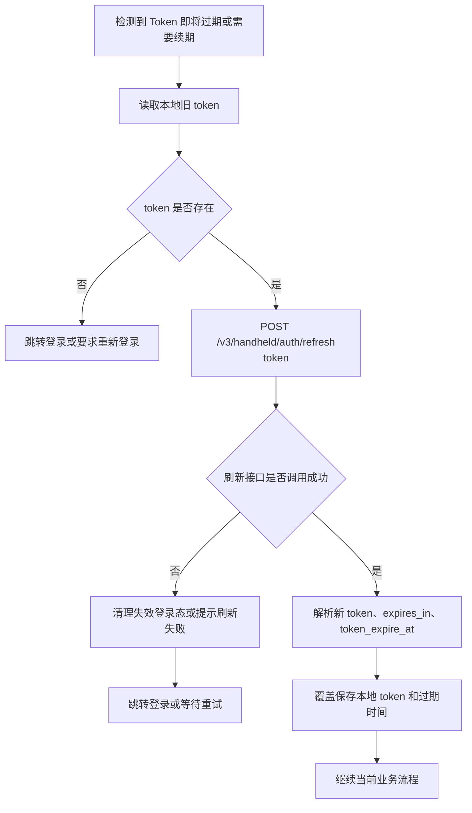

### Token刷新时序图

以下时序图描述客户端、刷新接口、后端认证服务和本地会话存储之间的交互顺序。

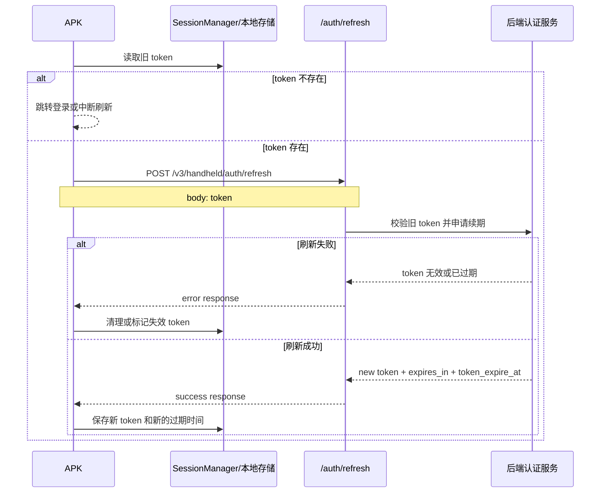

### 图示说明

1. `Token刷新` 接口只依赖旧 `token`，当前文档没有要求额外传 `device_id`。
2. 刷新成功后，客户端应覆盖保存新的 `token` 和新的过期时间，不能继续使用旧值。
3. 刷新失败通常意味着登录态已经不可用，客户端应回到登录流程或触发重新认证。

## 设备心跳

### 鉴权要求

需要携带用户登录 token：

```http
Authorization: Bearer <token>
```

### OpenAPI接口规范

```yaml
openapi: 3.0.1
info:
  title: ''
  description: ''
  version: 1.0.0
paths:
  /v3/handheld/device/heartbeat:
    post:
      summary: 设备心跳
      deprecated: false
      description: 事件任务驱动的轻量心跳接口，仅返回当前待处理事件摘要，不携带业务数据。
      tags:
        - 手持机接口
      parameters: []
      requestBody:
        content:
          application/json:
            schema:
              type: object
              properties:
                device_id:
                  type: string
                  description: 设备ID，通过该id 可以知道来自那个设备的心跳
                software_version:
                  type: string
                  description: APP版本号
                  examples:
                    - 1.0.0
                ip:
                  type: string
                  description: 设备IP地址
                  examples:
                    - 192.168.1.123
              x-apifox-orders:
                - device_id
                - software_version
                - ip
            example:
              device_id: A1B2C3D4E5F60789
              software_version: 1.0.0
              ip: 192.168.1.123
      responses:
        '200':
          description: 成功
          content:
            application/json:
              schema:
                type: object
                properties:
                  code:
                    type: integer
                    examples:
                      - 200
                  msg:
                    type: string
                    examples:
                      - success
                  data:
                    type: object
                    properties:
                      server_time:
                        type: integer
                      has_changes:
                        type: boolean
                        title: 是否有事件
                      events:
                        type: array
                        items:
                          type: object
                          properties:
                            cursor:
                              type: string
                              title: 事件标识
                            event_type:
                              type: string
                              title: 事件类型
                              description: person_changed=同步人员，config_changed=获取设备配置
                            scope_type:
                              type: string
                              description: 作用域类型，支持 device、line、global
                            scope_value:
                              type: string
                              description: 作用域值，global 时可为空
                          x-apifox-orders:
                            - cursor
                            - event_type
                            - scope_type
                            - scope_value
                    x-apifox-orders:
                      - server_time
                      - has_changes
                      - events
                x-apifox-orders:
                  - code
                  - msg
                  - data
              examples:
                有变更:
                  summary: 有数据变化
                  value:
                    code: 200
                    msg: success
                    data:
                      server_time: 1750001002
                      has_changes: true
                      events:
                        - cursor: evt_00000124
                          event_type: person_changed
                          scope_type: line
                          scope_value: LX-A-1
                        - cursor: evt_00000126
                          event_type: config_changed
                          scope_type: device
                          scope_value: PDA-2026-0018
                无变更:
                  summary: 无数据变化
                  value:
                    code: 200
                    msg: success
                    data:
                      server_time: 1750001002
                      has_changes: false
                      events: []
          headers: {}
          x-apifox-name: ''
      security: []
      x-apifox-folder: 手持机接口
      x-apifox-status: released
      x-run-in-apifox: https://app.apifox.com/web/project/8443306/apis/api-475048782-run
servers:
  - url: http://hzmq1.hainasmart.com.cn
    description: 正式环境
security: []
```

## 统一事件结果回传

### 鉴权要求

需要携带用户登录 token：

```http
Authorization: Bearer <token>
```

### OpenAPI接口规范

```yaml
openapi: 3.0.1
info:
  title: ''
  description: ''
  version: 1.0.0
paths:
  /v3/handheld/event/result:
    post:
      summary: 统一事件结果回传
      deprecated: false
      description: 手持机按事件标识回传处理结果，服务端按 device_id + cursor 做幂等确认
      tags:
        - 手持机接口
        - Handheld Event
      parameters: []
      requestBody:
        content:
          application/json:
            schema:
              type: object
              required:
                - device_id
                - cursor
                - event_type
                - success
              properties:
                device_id:
                  type: string
                  description: 设备ID
                cursor:
                  type: string
                  description: 事件唯一标识，由心跳接口下发，字段名沿用原先 cursor
                event_type:
                  type: string
                  description: 事件类型
                success:
                  type: boolean
                  description: 该事件是否处理成功
                employees:
                  type: array
                  description: 人员同步类事件的逐人处理结果，可选
                  items:
                    type: object
                    properties:
                      numbers:
                        type: string
                      op_type:
                        type: string
                      success:
                        type: boolean
                      fail_msg:
                        type: string
                    x-apifox-orders:
                      - numbers
                      - op_type
                      - success
                      - fail_msg
                failure_msg:
                  type: string
                  description: 事件级失败原因，success=false 时建议填写
              x-apifox-orders:
                - device_id
                - cursor
                - event_type
                - success
                - employees
                - failure_msg
            example:
              device_id: A1B2C3D4E5F60789
              cursor: evt_00000124
              event_type: person_changed
              success: true
              employees:
                - numbers: E001
                  op_type: sync
                  success: true
                  fail_msg: ''
                - numbers: E002
                  op_type: delete
                  success: true
                  fail_msg: ''
                - numbers: E003
                  op_type: sync
                  success: false
                  fail_msg: 人脸图片下载失败
              failure_msg: ''
      responses:
        '200':
          description: success
          content:
            application/json:
              schema:
                type: object
                properties:
                  code:
                    type: integer
                  msg:
                    type: string
                  data:
                    type: object
                    properties:
                      server_time:
                        type: integer
                      cursor:
                        type: string
                      accepted:
                        type: boolean
                        description: 是否已接收该结果，重复回传也返回 true
                      event_status:
                        type: string
                        description: 服务端事件状态，如 success / failed
                    x-apifox-orders:
                      - server_time
                      - cursor
                      - accepted
                      - event_status
                x-apifox-orders:
                  - code
                  - msg
                  - data
              example:
                code: 200
                msg: success
                data:
                  server_time: 1750524010
                  cursor: evt_00000124
                  accepted: true
                  event_status: success
          headers: {}
          x-apifox-name: ''
        '400':
          description: bad request
          content:
            application/json:
              schema:
                type: object
                properties: {}
              examples:
                missing_cursor:
                  summary: missing_cursor
                  value:
                    code: 400
                    msg: cursor 不能为空
                    data: null
                missing_event_type:
                  summary: missing_event_type
                  value:
                    code: 400
                    msg: event_type 不能为空
                    data: null
          headers: {}
          x-apifox-name: ''
        '401':
          description: unauthorized
          content:
            application/json:
              schema:
                type: object
                properties: {}
                x-apifox-orders: []
              example:
                code: 401
                msg: 未获取到设备信息
                data: null
          headers: {}
          x-apifox-name: ''
        '404':
          description: not found
          content:
            application/json:
              schema:
                type: object
                properties: {}
                x-apifox-orders: []
              example:
                code: 404
                msg: 事件不存在或不属于当前设备
                data: null
          headers: {}
          x-apifox-name: ''
        '500':
          description: server error
          content:
            application/json:
              schema:
                type: object
                properties: {}
                x-apifox-orders: []
              example:
                code: 500
                msg: 处理失败
                data: null
          headers: {}
          x-apifox-name: ''
      security: []
      x-apifox-folder: 手持机接口
      x-apifox-status: released
      x-run-in-apifox: https://app.apifox.com/web/project/8443306/apis/api-478131650-run
servers:
  - url: http://hzmq1.hainasmart.com.cn
    description: 正式环境
security: []
```

### 事件分发设计说明

1. 当前接口组合已经从“事件流游标确认”切换为“事件任务逐条确认”。
2. `/v3/handheld/device/heartbeat` 只负责下发当前设备待处理的事件摘要，不再承担“客户端消费位置确认”职责。
3. `/v3/handheld/event/result` 负责按 `device_id + cursor` 回传处理结果，服务端据此维护每条事件的状态。
4. 在这套模型下，客户端不再需要维护 `last_applied_event_cursor`、`latest_cursor` 之类的消费游标。
5. `cursor` 在当前协议里承担的是事件唯一标识职责，不再表示“顺序推进的流位置”。
6. 服务端应保证 `/v3/handheld/event/result` 幂等：同一 `device_id + cursor` 重复回传时返回 `200`，不能把“已处理”当成错误。

### 设备心跳 + 事件结果回传流程图

以下流程图描述当前协议下，设备如何通过 heartbeat 拉取待处理事件，并通过 `/v3/handheld/event/result` 逐条回传结果。

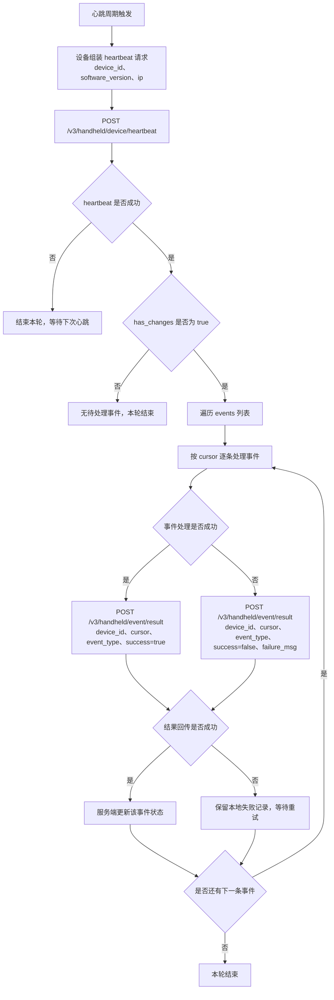

### 设备心跳 + 事件结果回传时序图

以下时序图描述设备、心跳接口、事件处理逻辑和结果回传接口之间的交互顺序。

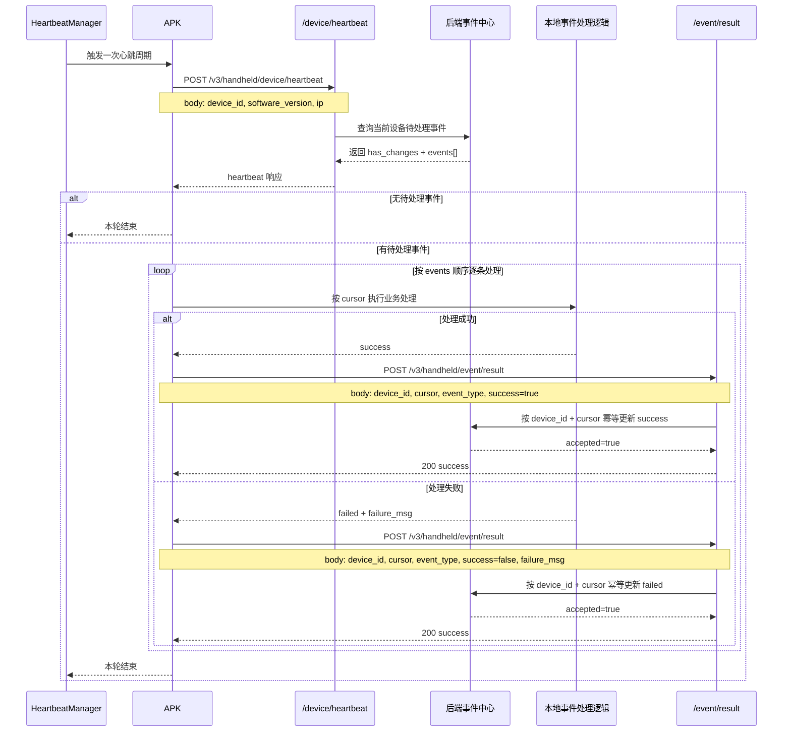

### 图示说明

1. `heartbeat` 只负责发现和下发待处理事件，不负责确认消费位置。
2. 事件是否已处理，以 `/v3/handheld/event/result` 的回传结果为准，不再依赖游标推进。
3. 同一 `cursor` 的结果回传必须允许重复提交，服务端按幂等方式处理。
4. 若设备本地业务处理成功，但结果回传失败，设备应保留待补发记录，后续再次回传该 `cursor` 的处理结果。

## 同步员工列表

### 鉴权要求

需要携带用户登录 token：

```http
Authorization: Bearer <token>
```

### OpenAPI接口规范

```yaml
openapi: 3.0.1
info:
  title: ''
  description: ''
  version: 1.0.0
paths:
  /v3/handheld/employee/sync:
    post:
      summary: 同步员工列表，当通过心跳获取到 person_changed 事件时，就需要根据事件中员工 id 来查询，然后根据响应结果中 op_type 来在 app 客户端进行对应处理
      deprecated: false
      description: ''
      tags:
        - 手持机接口
        - 员工管理
      parameters: []
      requestBody:
        content:
          application/json:
            schema:
              type: object
              required:
                - device_id
              properties:
                device_id:
                  type: string
                  description: 设备ID，用于按当前设备范围同步员工列表
              x-apifox-orders:
                - device_id
                - page
                - page_size
                - op_status
            example:
              device_id: A1B2C3D4E5F60789
              page: 1
              page_size: 500
              op_status: 1
      responses:
        '200':
          description: success
          content:
            application/json:
              schema:
                type: object
                properties: {}
              example:
                code: 200
                msg: success
                data:
                  employees:
                    - numbers: E001
                      name: 张建国
                      face_image_url: https://cdn.example.com/avatar/E001.jpg
                      op_type: sync
                      op_time: 1750524000
                    - numbers: E002
                      name: 李秀英
                      face_image_url: ''
                      op_type: delete
                      op_time: 1750524000
                  total: 100
                  total_pages: 1
                  page: 1
                  page_size: 500
                  has_more: false
                  server_time: 1750524010
          headers: {}
          x-apifox-name: ''
      security: []
      x-apifox-folder: 手持机接口
      x-apifox-status: released
      x-run-in-apifox: https://app.apifox.com/web/project/8443306/apis/api-476422468-run
servers:
  - url: http://hzmq1.hainasmart.com.cn
    description: 正式环境
security: []
```


### 同步员工列表流程图

以下流程图描述客户端在收到 `person_changed` 事件后，如何调用 `/v3/handheld/employee/sync` 同步员工列表并根据 `op_type` 执行本地处理。

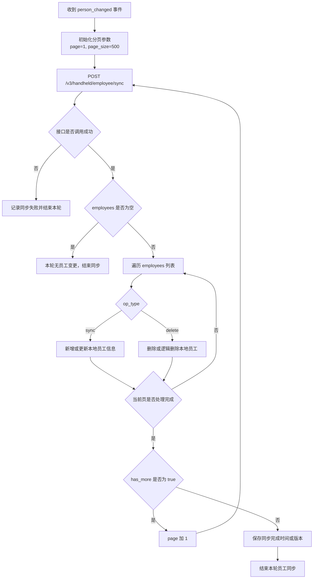

### 同步员工列表时序图

以下时序图描述客户端、员工同步接口、平台后端和本地数据库之间的交互顺序。

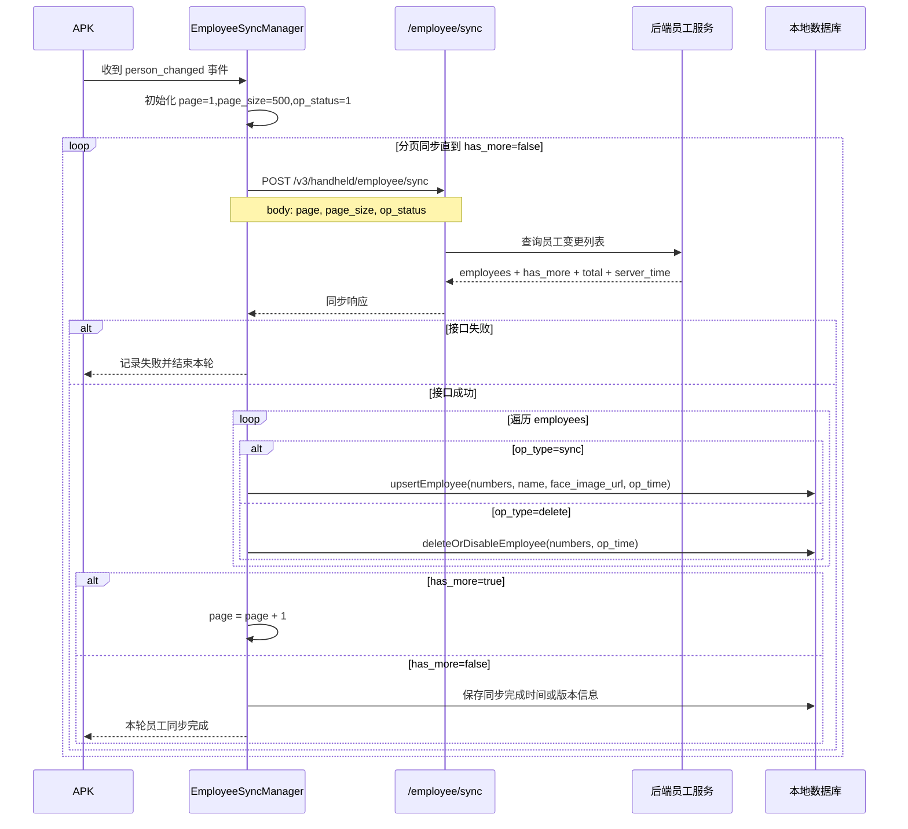

### 图示说明

1. 当前接口文档只体现 `page`、`page_size`、`op_status` 三个请求字段，因此图中按分页拉取设计，不引入额外的游标字段。
2. `op_type=sync` 表示客户端需要新增或更新员工资料，`op_type=delete` 表示客户端需要删除或逻辑删除本地员工。
3. 只有当前页员工数据全部成功处理后，客户端才应继续下一页。
4. 若任一页请求失败或本地落库失败，当前轮同步应停止，并等待下一次事件重试或人工处理。

## 同步设备配置

### 鉴权要求

需要携带用户登录 token：

```http
Authorization: Bearer <token>
```

### OpenAPI接口规范

```yaml
openapi: 3.0.1
info:
  title: ''
  description: ''
  version: 1.0.0
paths:
  /v3/handheld/device/get-config:
    post:
      summary: 同步设备配置
      deprecated: false
      description: ''
      tags:
        - 手持机接口
        - 设备管理
      parameters: []
      requestBody:
        content:
          application/json:
            schema:
              type: object
              x-apifox-orders: []
              properties: {}
            examples: {}
      responses:
        '200':
          description: success
          content:
            application/json:
              schema:
                type: object
                properties: {}
              example:
                code: 200
                data:
                  account: admin
                  check_count: 5
                  baidu_params:
                    face_threshold: 68
                    liveness_check: true
                    mask_detect: true
                    match_threshold: 41
                    recognize_distance: 3
                    timeout: 5
                  device_id: PDA-2026-0017
                  line_binding_code: PKZ450
                  line_binding_name: SMT线1
                  lines:
                    - code: PKZ450
                      name: SMT线1
                    - code: PJJM3O
                      name: SMT线2
                  need_update: true
                  password: admin
                  team_binding: 1
                  team_binding_name: 班组C
                  teams:
                    - id: '1'
                      name: 班组C
                      time_ranges:
                        - 09:00-22:00
                    - id: '2'
                      name: 班组B
                      time_ranges:
                        - 09:30-12:00
                        - 14:00-16:00
                        - 17:00-20:00
                    - id: '4'
                      name: 班组A
                      time_ranges:
                        - 09:00-17:00
                        - 23:00-05:00
                  update:
                    apk_url: >-
                      http://192.168.1.180/storage/uploaded/2026_06/e9370d365d961e8f60c011369f9cc990.apk
                    current_version: 1.0.0
                    need_update: true
                    target_version: 2.0.0
                    version_name: 正式版本
                msg: 获取成功
          headers: {}
          x-apifox-name: ''
      security: []
      x-apifox-folder: 手持机接口
      x-apifox-status: released
      x-run-in-apifox: https://app.apifox.com/web/project/8443306/apis/api-476430115-run
servers:
  - url: http://hzmq1.hainasmart.com.cn
    description: 正式环境
security: []
```
- check_count 字段是限制打卡人数(按“日期+线体+班组+班次”，相同人员打卡不算)
- baidu_params 字段是百度人脸识别 配置参数
  - face_threshold：人脸检测阈值
  - match_threshold：人脸比对阈值
  - mask_detect：启用口罩检测
  - liveness_check：启用活体检测
  - recognize_distance：识别距离
  - timeout: 识别超时时间
- line_binding_code 字段是默认绑定的线体编码
- line_binding_name 字段是默认绑定的线体名称

### 同步设备配置流程图

以下流程图描述客户端在收到 `config_changed` 事件后，如何直接调用 `/v3/handheld/device/get-config` 拉取并应用最新设备配置。

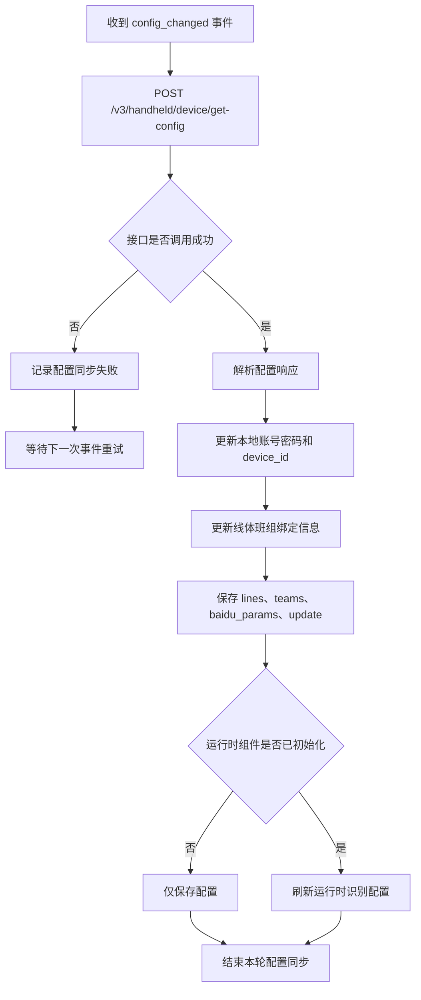

### 同步设备配置时序图

以下时序图描述客户端、设备配置接口、平台后端和本地配置存储之间的交互顺序。

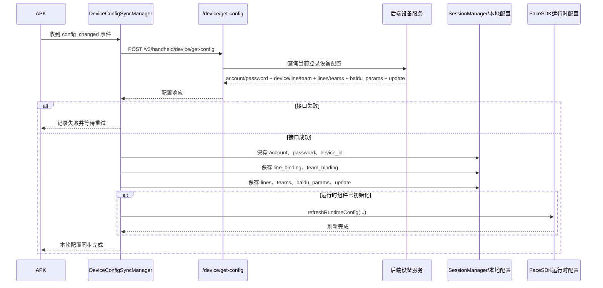

### 图示说明

1. 当前接口正文未定义请求体字段，因此图示按“直接调用接口获取当前登录设备配置”展开。
2. 配置同步成功后，至少需要更新本地账号、密码、设备绑定信息、线体班组绑定信息和 `baidu_params`。
3. 若响应包含 `lines`、`teams`、`update` 等扩展数据，客户端也应一并保存，供页面展示或版本升级判断使用。
4. 若运行时识别组件已经初始化，配置落地后应立即刷新运行时参数；否则只保存，等待下次初始化时生效。


## 打卡上传

### 鉴权要求

需要携带用户登录 token：

```http
Authorization: Bearer <token>
```

### OpenAPI接口规范

```yaml
openapi: 3.0.1
info:
  title: ''
  description: ''
  version: 1.0.0
paths:
  /v3/handheld/clock/upload:
    post:
      summary: 打卡上传
      deprecated: false
      description: 手持机上传上下班打卡记录，服务端写入打卡记录并更新考勤报表
      tags:
        - 手持机接口
        - Handheld Clock
      parameters: []
      requestBody:
        content:
          application/json:
            schema:
              type: object
              required:
                - numbers
                - team_binding
                - line_binding_code
                - snap_time
              properties:
                numbers:
                  type: string
                  description: 员工编号（工号）
                  examples:
                    - pnFNxH
                team_binding:
                  type: integer
                  description: 班组绑定值
                  examples:
                    - 2
                line_binding_code:
                  type: string
                  description: 当前打卡线体编码
                  examples:
                    - PKZ450
                snap_time:
                  type: integer
                  description: Unix秒级时间戳（不传或0则用服务器时间）
                  examples:
                    - 1782424800
              x-apifox-orders:
                - numbers
                - team_binding
                - line_binding_code
                - snap_time
            example:
              numbers: pnFNxH
              team_binding: 2
              line_binding_code: PKZ450
              snap_time: 1782424800
      responses:
        '200':
          description: success
          content:
            application/json:
              schema:
                type: object
                properties:
                  code:
                    type: integer
                    examples:
                      - 200
                  msg:
                    type: string
                    examples:
                      - success
                  data:
                    type: object
                    properties:
                      record_id:
                        type: integer
                        examples:
                          - 12345
                      snap_time:
                        type: integer
                        examples:
                          - 1751452800
                      snap_time_str:
                        type: string
                        examples:
                          - '08:30:00'
                      dates:
                        type: string
                        examples:
                          - '2025-07-02'
                      attend_report_id:
                        type: integer
                        examples:
                          - 67890
                      attend_report_table:
                        type: string
                        examples:
                          - hzq_attend_report_1_20257
                    x-apifox-orders:
                      - record_id
                      - snap_time
                      - snap_time_str
                      - dates
                      - attend_report_id
                      - attend_report_table
                x-apifox-orders:
                  - code
                  - msg
                  - data
          headers: {}
          x-apifox-name: ''
        '400':
          description: 参数错误
          headers: {}
          x-apifox-name: ''
        '401':
          description: 未获取到设备信息 / token无效
          headers: {}
          x-apifox-name: ''
        '404':
          description: 人员、班组或线体不存在
          headers: {}
          x-apifox-name: ''
        '500':
          description: 写入打卡记录失败
          headers: {}
          x-apifox-name: ''
      security: []
      x-apifox-folder: 手持机接口
      x-apifox-status: released
      x-run-in-apifox: https://app.apifox.com/web/project/8443306/apis/api-478395866-run
components:
  schemas: {}
  securitySchemes:
    BearerAuth:
      type: jwt
      scheme: bearer
      bearerFormat: JWT
servers:
  - url: http://hzmq1.hainasmart.com.cn
    description: 正式环境
security: []
```


### 打卡上传流程图

以下流程图描述手持机采集打卡信息后，调用 `/v3/handheld/clock/upload` 上传记录并接收服务端回执的主流程。

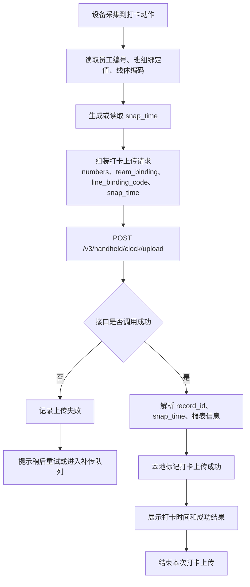

## 打卡上传时序图

以下时序图描述设备、打卡上传接口、后端服务和本地记录存储之间的交互顺序。

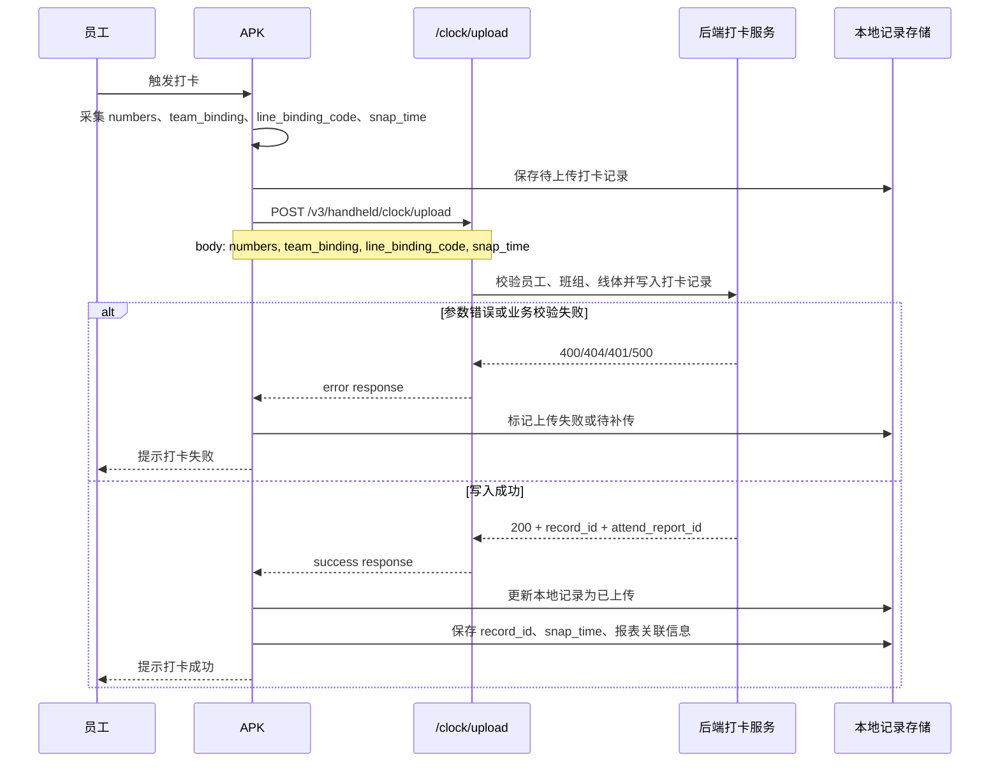

### 图示说明

1. 当前接口文档的请求字段是 `numbers`、`team_binding`、`line_binding_code`、`snap_time`，图示严格按这四个字段展开。
2. `snap_time` 不传或为 `0` 时，服务端可以按接口说明使用服务器时间，但客户端有能力时仍建议显式传入采集时间。
3. 打卡上传失败后，客户端更合理的处理方式是保留本地记录并进入补传队列，而不是直接丢弃。
4. 上传成功后，客户端应保存服务端返回的 `record_id` 和报表关联信息，便于后续追踪和对账。

## 打卡统计

需要携带用户登录 token：

```http
Authorization: Bearer <token>
```

### OpenAPI接口规范

```yaml
openapi: 3.0.1
info:
  title: ''
  description: ''
  version: 1.0.0
paths:
  /v3/handheld/clock/statistics:
    post:
      summary: 打卡统计
      deprecated: false
      description: 手持机按当日 + 线体 + 第几次打卡维度查询人员打卡情况
      tags:
        - 手持机接口
        - Handheld Clock
      parameters:
        - name: Authorization
          in: header
          description: Bearer device_token
          required: true
          example: ''
          schema:
            type: string
      requestBody:
        content:
          application/json:
            schema:
              type: object
              properties:
                dates:
                  type: string
                  description: 打卡日期 YYYY-MM-DD
                  examples:
                    - '2026-06-27'
                  example: '2026-06-27'
                line_code:
                  type: string
                  description: 线体code
                  example: 4sada
                clock_index:
                  type: integer
                  description: |
                    第几次打卡：
                    0=自由打卡
                    1=第一次上班
                    2=第一次下班
                    3=第二次上班
                    4=第二次下班
                    5=第三次上班
                    6=第三次下班
                  examples:
                    - 1
                  example: 1
                clock_status:
                  type: integer
                  description: |
                    打卡状态过滤：
                    1=已打卡
                    2=未打卡
                    3=特殊打卡
                  examples:
                    - 1
                  example: 1
                page:
                  type: integer
                  description: 页码（默认1）
                  examples:
                    - 1
                  example: 1
                page_size:
                  type: integer
                  description: 每页条数（默认20，上限100）
                  examples:
                    - 20
                  example: 20
              required:
                - dates
                - line_code
                - clock_index
            examples: {}
      responses:
        '200':
          description: success
          content:
            application/json:
              schema:
                type: object
                properties:
                  code:
                    type: integer
                    examples:
                      - 200
                  msg:
                    type: string
                    examples:
                      - success
                  data:
                    type: object
                    properties:
                      date:
                        type: string
                      clock_index:
                        type: integer
                      clock_index_name:
                        type: string
                      summary:
                        type: object
                        properties:
                          total:
                            type: integer
                          clocked:
                            type: integer
                          unclocked:
                            type: integer
                          special:
                            type: integer
                        x-apifox-orders:
                          - total
                          - clocked
                          - unclocked
                          - special
                      total:
                        type: integer
                      page:
                        type: integer
                      page_size:
                        type: integer
                      rows:
                        type: array
                        items:
                          type: object
                          properties:
                            numbers:
                              type: string
                            name:
                              type: string
                            line_id:
                              type: integer
                            line_name:
                              type: string
                            face_path:
                              type: string
                            clock_time:
                              type: string
                            clock_status:
                              type: integer
                            clock_status_text:
                              type: string
                            sign:
                              type: string
                            special_text:
                              type: string
                            late_minutes:
                              type: integer
                            early_minutes:
                              type: integer
                          x-apifox-orders:
                            - numbers
                            - name
                            - line_id
                            - line_name
                            - face_path
                            - clock_time
                            - clock_status
                            - clock_status_text
                            - sign
                            - special_text
                            - late_minutes
                            - early_minutes
                      line_code:
                        type: integer
                    x-apifox-orders:
                      - date
                      - line_code
                      - clock_index
                      - clock_index_name
                      - summary
                      - total
                      - page
                      - page_size
                      - rows
                x-apifox-orders:
                  - code
                  - msg
                  - data
          headers: {}
          x-apifox-name: ''
        '400':
          description: 参数错误
          content:
            application/json:
              schema:
                type: object
                properties:
                  code:
                    type: integer
                  msg:
                    type: string
                x-apifox-orders:
                  - code
                  - msg
          headers: {}
          x-apifox-name: ''
        '401':
          description: 未授权
          content:
            application/json:
              schema:
                type: object
                properties:
                  code:
                    type: integer
                  msg:
                    type: string
                x-apifox-orders:
                  - code
                  - msg
          headers: {}
          x-apifox-name: ''
        '500':
          description: 服务器错误
          content:
            application/json:
              schema:
                type: object
                properties:
                  code:
                    type: integer
                  msg:
                    type: string
                x-apifox-orders:
                  - code
                  - msg
          headers: {}
          x-apifox-name: ''
      security: []
      x-apifox-folder: 手持机接口
      x-apifox-status: released
      x-run-in-apifox: https://app.apifox.com/web/project/8443306/apis/api-479159896-run
components:
  schemas: {}
  securitySchemes:
    BearerAuth:
      type: jwt
      scheme: bearer
      bearerFormat: JWT
servers:
  - url: http://hzmq1.hainasmart.com.cn
    description: 正式环境
security: []
```

- 当离线的时候，记录面板是显示根据日期和班次为条件，查询本地打卡记录来显示
- 当在线的时候，调用上面的接口，根据日期、班次、打卡状态为条件，查询后端平台记录来显示
- 无论在线还是离线，记录通过下拉来分页动态加载，不需要一次加载所有
- body参数详解：
  - dates：打卡日期
  - line_code：线体
  - clock_index：班次选项索引
  - clock_status：打卡状态
    - 0：全部状态
    - 1：已打卡
    - 2：未打卡
    - 3：特殊打卡
  - page：页号
  - page_size：该页记录大小
- rows字段描述
   - number: 员工编号
   - name: 员工姓名
   - line_id: 线体编码
   - line_name: 线体名称
   - face_path: 完整的员工图片
   - clock_time: 员工打卡时间
   - clock_status: 员工打卡状态
   - clock_status_text: 员工打卡状态名称
   - sign: 是状态标识 normal=正常,absence=缺卡,late=迟到,leave=请假,out=外出,travel=出差,early=早退', 可以用来标识显示不同的颜色
   - late_minutes：员工迟到分钟数
   - early_minutes：员工早退分钟数
- summary字段描述
   - total: 当前分页请求总人数
   - clocked: 打卡人数
   - unclocked: 未打卡人数
   - special: 特殊打卡人数
- total字段: 总人数
